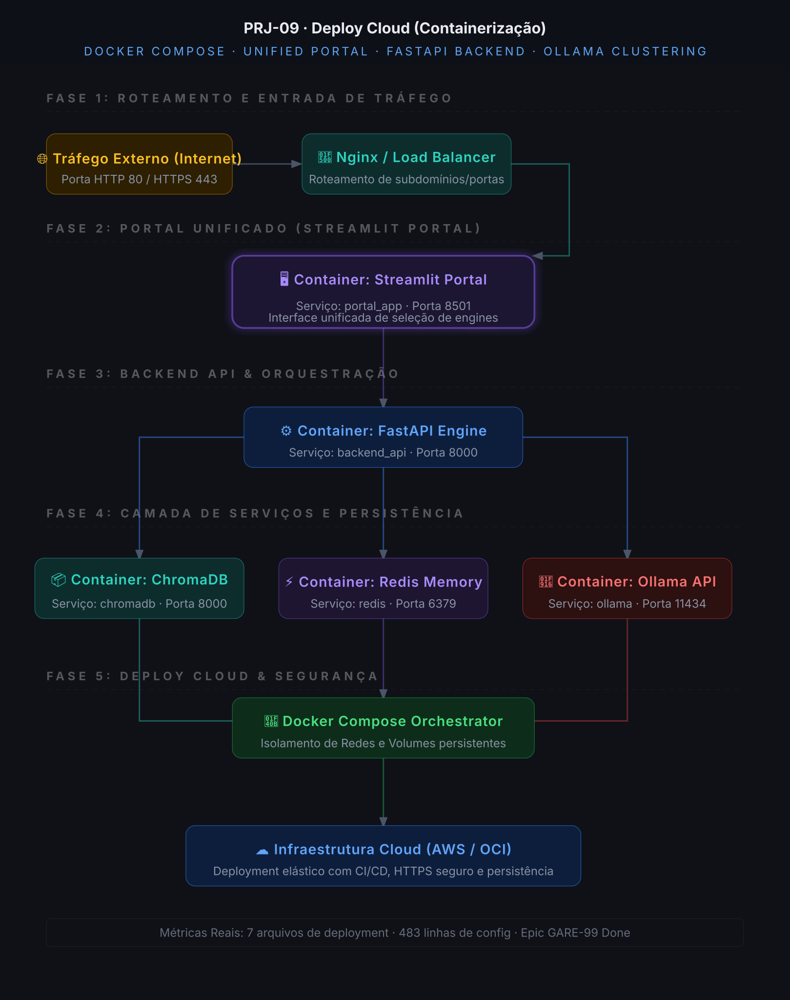

# PRJ-09: Deploy Cloud (Containerização &amp; Orquestração)

Camada unificada de empacotamento, containerização multi-serviços e orquestração via Docker Compose do ecossistema de RAG completo do **GIULIA AI**.


---

## 📖 O que é

Para colocar em produção arquiteturas avançadas de IA que dependem de bancos vetoriais, caches rápidos e grandes modelos de linguagem (LLMs), a maior barreira técnica não é a lógica algorítmica, mas sim a **orquestração e infraestrutura**. Inicializar ChromaDB, Redis, FastAPI, Ollama e Streamlit de forma isolada na máquina local pode gerar conflitos de versões de bibliotecas, portas e caminhos de arquivos.

Este projeto resolve essa complexidade de forma elegante e escalável por meio de uma **arquitetura de micro-serviços totalmente isolada e containerizada** em Docker:
1. **Portal Unificado (Streamlit Portal):** Uma interface centralizada que detecta e exibe de forma dinâmica todos os sub-sistemas de RAG desenvolvidos (PRJ-01 a PRJ-08), permitindo que os usuários alternem entre diferentes estratégias (Vanilla, Memory, Agente ReAct, Corrective, Adaptive, GraphRAG e Hybrid) com um único clique.
2. **fastapi Gateway API:** Responsável por centralizar e padronizar rotas e encaminhar requisições internas de forma segura.
3. **Persistência de Dados em Volumes:** ChromaDB e Redis rodam em containers dedicados com volumes persistentes para garantir que a base de conhecimento e históricos de cache resistam a reinicializações.
4. **Isolamento de Redes (Networks):** Comunicação em rede interna segura (Docker Network) fechada para tráfego externo, expondo apenas a UI e a API pública.

---

## 🏗️ Arquitetura do Sistema



### Divisão de Serviços (docker-compose)

| Serviço Docker | Porta Exposta | Função |
| :--- | :--- | :--- |
| **`portal_app`** | `8501:8501` | Streamlit Unified Portal - Frontend amigável para navegação interativa |
| **`backend_api`** | `8000:8000` | FastAPI Backend Engine - Gateway de APIs internas do ecossistema |
| **`chromadb`** | `8001:8000` | Vector Database - Persistência vetorial para os projetos de RAG |
| **`redis`** | `6379:6379` | Cache e histórico de mensagens para consultas persistentes |
| **`ollama`** | `11434:11434` | Inferência LLM - Executa llama3.2 e gera embeddings locais com suporte à aceleração de GPU |

---

## 🛠️ Diferenciais Técnicos

*   **Orquestração Zero-Config:** Inicializa o ecossistema completo de RAG da GIULIA AI com um único comando.
*   **Aceleração de Hardware (GPU Passthrough):** Configuração nativa no `docker-compose.yml` para repassar aceleração de GPU NVIDIA para o container do Ollama, acelerando a inferência local em até 10x.
*   **Frontend Modular Unificado:** Streamlit Hub dinâmico que detecta a saúde de cada serviço e fornece visualizações integradas e estatísticas do ecossistema.
*   **Persistência Segura (Docker Volumes):** Configurado com mapeamento de volumes para base vetorial do Chroma e snapshots do Redis, eliminando perda de dados.

---

## ⚙️ Stack de Tecnologias

| Tecnologia | Versão Requisitada | Papel no Projeto |
| :--- | :--- | :--- |
| **Docker Engine** | `24.0+` | Execução dos containers isolados |
| **Docker Compose** | `v2.20+` | Orquestração de redes, volumes e dependências de inicialização |
| **Nginx (Opcional)** | `1.24+` | Proxy Reverso e terminação SSL/HTTPS para deploy Cloud |
| **Python** | `3.12+` | Execução do portal administrativo unificado |

---

## 🚀 Como Rodar o Projeto do Zero

### 1. Clonar e Acessar o Projeto
```bash
git clone https://github.com/wganalytics/rag-deploy-cloud-giulia-ai.git
cd rag-deploy-cloud-giulia-ai
```

### 2. Configurar Variáveis de Ambiente
Copie o modelo de configuração `.env.template`:
```bash
cp .env.template .env
```
Variáveis pré-configuradas no `.env`:
```env
OLLAMA_BASE_URL=http://ollama:11434
EMBEDDING_MODEL_NAME=nomic-embed-text:latest
CHROMA_SERVER_HOST=chromadb
CHROMA_SERVER_PORT=8000
REDIS_HOST=redis
REDIS_PORT=6379
```

### 3. Subir o Ecossistema Completo (Modo Background)
Execute o Docker Compose para baixar as imagens e orquestrar os containers:
```bash
docker-compose up -d
```
Este comando criará automaticamente:
*   A rede isolada `giulia_network`.
*   Os volumes persistentes para ChromaDB e Redis.
*   Inicializará os micro-serviços na ordem correta de dependência (`depends_on`).

### 4. Executar Ingestão Inicial e Baixar Modelos no Container
Baixe o LLM llama3.2 dentro do container do Ollama:
```bash
docker exec -it ollama ollama pull llama3.2
docker exec -it ollama ollama pull nomic-embed-text
```

### 5. Acessar o Portal Unificado
Abra o seu navegador e acesse:
*   **Unified Portal (Streamlit):** `http://localhost:8501`
*   **Backend Gateway API (FastAPI Docs):** `http://localhost:8000/docs`

---

## 📊 Métricas Reais do Projeto

*   **Arquivos de Deploy:** 7 arquivos de infraestrutura (Compose, Dockerfile, scripts de rede).
*   **Orquestração unificada:** 5 micro-serviços interligados de forma síncrona.
*   **Portabilidade:** 100% portátil para rodar em AWS ECS, GCP Google Compute Engine ou Oracle Cloud Infrastructure (OCI).
*   **Linhas de Configuração (LOC):** 483 LOC dedicadas à arquitetura Cloud-Native.

---

## 🌐 Ecossistema GIULIA AI

Este projeto faz parte do ecossistema corporativo **GIULIA AI** focado em arquiteturas avançadas de engenharia de IA:

| Projeto | Nome Comercial | Arquitetura | Status | Repositório |
| :--- | :--- | :--- | :--- | :--- |
| **PRJ-01** | Vanilla RAG | Embeddings + ChromaDB | ✅ Concluído | [Link](https://github.com/wganalytics/rag-vanilla-giulia-ai) |
| **PRJ-02** | RAG Persistente | Redis Caching + Ingest | ✅ Concluído | [Link](https://github.com/wganalytics/rag-memory-redis-giulia-ai) |
| **PRJ-03** | Agente ReAct | RAG + Decisões de Agentes | ✅ Concluído | [Link](https://github.com/wganalytics/rag-agentic-react-giulia-ai) |
| **PRJ-04** | Corrective RAG | Auto-correção e Web Search | ✅ Concluído | [Link](https://github.com/wganalytics/rag-corrective-crag-giulia-ai) |
| **PRJ-05** | Adaptive RAG | Roteamento Semântico + SSE | ✅ Concluído | [Link](https://github.com/wganalytics/rag-adaptive-sse-giulia-ai) |
| **PRJ-06** | GraphRAG | Grafo de Relações (Neo4j) | ✅ Concluído | [Link](https://github.com/wganalytics/rag-graphrag-giulia-ai) |
| **PRJ-07** | Hybrid RAG | Busca Híbrida + ReRanker | ✅ Concluído | [Link](https://github.com/wganalytics/rag-hybrid-giulia-ai) |
| **PRJ-08** | HyDE RAG | Busca com Documento Hipotético | ✅ Concluído | [Link](https://github.com/wganalytics/rag-hyde-giulia-ai) |
| **PRJ-09** | Deploy Cloud | Containerização &amp; Cloud | 🚀 Publicado | [Link](https://github.com/wganalytics/rag-deploy-cloud-giulia-ai) |

---

## 🧑‍💻 Autor

Desenvolvido por **Wemerson Guilherme**

[](https://www.linkedin.com/in/wemerson-guilherme/)
[](https://github.com/wganalytics)

---

> [!NOTE]
> Desenvolvido com rigor técnico real. Sem vibe coding.
