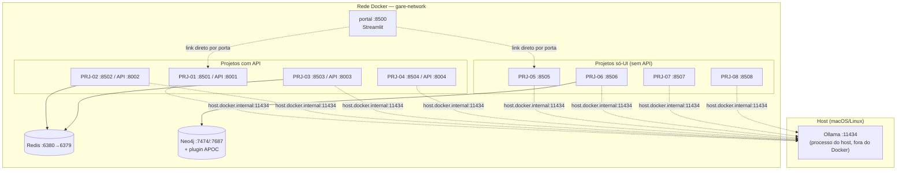

# PRJ-09 — Deploy Cloud: Orquestração do Ecossistema RAG

Camada de infraestrutura e orquestração do ecossistema Giulia AI. Não implementa
mais uma técnica de RAG — sobe as oito implementações anteriores (PRJ-01 a
PRJ-08), a infraestrutura compartilhada (Redis, Neo4j com APOC) e um portal de
navegação, tudo com um único `docker compose up`.

## Por que isso importa

Os PRJ-01 a PRJ-08 são oito implementações progressivas de RAG — Vanilla,
Memory, Agentic, Corrective, Adaptive, GraphRAG, Hybrid e HyDE — cada uma com
seu próprio código, dependências e (em alguns casos) banco de dados. Sem uma
camada de orquestração, avaliar ou demonstrar o conjunto significa entrar em
oito pastas, subir oito ambientes Python separados e lembrar manualmente qual
projeto precisa de Redis, qual precisa de Neo4j e qual não tem API.

O PRJ-09 resolve isso como um problema de infraestrutura: uma imagem Docker,
um arquivo de composição, um portal Streamlit que lista os nove projetos,
mostra o status de cada um e abre a interface certa na porta certa. O
objetivo não é reescrever os oito projetos — é torná-los operáveis como um
conjunto, algo que qualquer stack com múltiplos serviços correlatos (não só
RAG) eventualmente precisa resolver.

Este README também documenta, na seção mais longa abaixo, uma sessão de
depuração real: o ecossistema tinha sido reorganizado de pasta e o PRJ-09
parou de funcionar — em silêncio, sem nenhuma mensagem de erro. Reconstruir o
raciocínio que levou de "tela vazia" a "quinze causas isoladas e corrigidas"
é, para efeito de portfólio, mais representativo do trabalho de engenharia
real do que o `docker-compose.yml` em si.

## Arquitetura de serviços



### Mapa de portas

| Serviço | Interface | API | Infra que usa |
|---|---|---|---|
| Portal | 8500 | — | lê `shared/REGISTRY/` e `project_context/` de cada projeto |
| PRJ-01 Vanilla RAG | 8501 | 8001 | Chroma embutido |
| PRJ-02 Memory RAG | 8502 | 8002 | Chroma + Redis |
| PRJ-03 Agentic RAG | 8503 | 8003 | Chroma + Redis |
| PRJ-04 Corrective RAG | 8504 | 8004 | Chroma |
| PRJ-05 Adaptive RAG | 8505 | — | Chroma (acesso direto do Streamlit) |
| PRJ-06 GraphRAG | 8506 | — | Neo4j (acesso direto do Streamlit) |
| PRJ-07 Hybrid RAG | 8507 | — | Chroma (acesso direto do Streamlit) |
| PRJ-08 HyDE RAG | 8508 | — | Chroma (acesso direto do Streamlit) |
| Redis | — | — | 6380 no host → 6379 no container |
| Neo4j | — | — | 7474 (HTTP) / 7687 (Bolt), plugin APOC |
| Ollama | — | — | 11434, **no host**, fora do Docker |

PRJ-05, PRJ-06, PRJ-07 e PRJ-08 não têm API própria — a interface Streamlit
acessa o banco vetorial (ou grafo) diretamente. O compose antigo tentava
subir um serviço `prj-06-api` rodando `uvicorn src.main:app`, arquivo que
nunca existiu nesse projeto.

## Decisões de arquitetura

**Ollama roda no host, não em container.** Ele já tem dezenas de gigabytes de
modelos baixados; subir outro Ollama em container criaria conflito na porta
11434 e obrigaria a baixar tudo de novo. Os containers alcançam o host via
`host.docker.internal` — o `extra_hosts: host.docker.internal:host-gateway`
no compose garante que isso funcione também no Linux, onde esse hostname não
existe por padrão (é resolução automática só no Docker Desktop macOS/Windows).

**O código dos oito projetos não entra na imagem.** A raiz do monorepo é
montada como volume (`../../..:/app`), então uma edição no host vale na hora,
sem rebuild. Só as dependências Python ficam na imagem — código e imagem são
coisas que mudam em ritmos diferentes, e acoplá-los custa tempo de build a
cada alteração de uma linha de app.

**Uma única imagem serve os oito projetos.** `docker/requirements.txt`
consolida o que PRJ-01 a PRJ-08 precisam. Construir oito imagens quase
idênticas seria desperdício de disco e de tempo — a diferença entre os
projetos está no código (montado por volume) e no comando de start, não nas
bibliotecas instaladas.

**O contexto de build é a pasta `docker/`, não a raiz do monorepo.** Motivo
detalhado na seção seguinte — foi a descoberta mais cara desta sessão de
depuração.

## Como rodar

```bash
cd dev/rag/PRJ-09_Deploy_Cloud
docker compose build          # primeira vez: demorado (PRJ-07 puxa torch)
docker compose up -d
```

Portal em **http://localhost:8500**.

Subir só um projeto:

```bash
docker compose up -d prj-06-ui              # projetos sem API (05, 06, 07, 08)
docker compose up -d prj-03-api prj-03-ui   # projetos com API (01 a 04)
```

As chaves de API de cada provedor (Gemini, Groq, xAI/Grok) ficam no `.env` de
cada projeto individual (`dev/rag/PRJ-0X_.../.env`), carregadas via
`env_file` no compose — nunca aparecem no `docker-compose.yml` nem entram na
imagem, e seguem ignoradas pelo Git. O bloco `environment` do compose
sobrepõe o `env_file`: é assim que `localhost`, gravado no `.env` de cada
projeto para uso fora do Docker, vira o nome do serviço (`redis`, `neo4j`,
`prj-01-api`) dentro da rede Docker.

## O que estava quebrado antes desta revisão

Este é o ponto que mais vale registrar. O PRJ-09 foi escrito quando os
projetos RAG viviam em `DEV/`, na raiz do repositório. Numa reorganização
posterior, o monorepo inteiro migrou para `dev/rag/` — e o PRJ-09 nunca foi
atualizado para acompanhar. O sintoma não foi um erro de build nem uma
exceção em log: foi uma tela em branco. O portal Streamlit subia, respondia
na porta 8500, e simplesmente não mostrava nada — porque toda leitura de
arquivo dependia de um caminho que não existia mais, e o código engolia a
falha sem avisar.

Diagnosticar isso exigiu não confiar em nenhuma suposição sobre o estado do
repositório e verificar, um a um, todo caminho hardcoded contra a árvore de
arquivos real. O resultado foram quinze causas distintas, a maioria
silenciosa:

| # | Item | Estado anterior (quebrado) |
|---|------|-----------------------------|
| 1 | `working_dir` de todos os serviços | apontava para `/app/DEV/PRJ-0X...`, pasta que não existia mais |
| 2 | `context: ../..` do build | resolvia para `dev/`, não para a raiz do monorepo |
| 3 | Nome de pasta do PRJ-02 no compose | `PRJ-02_Memoria_RAG`; a pasta real é `PRJ-02_Memory_RAG` |
| 4 | `Dockerfile` | fazia `COPY INFRA/lib`, pasta que não existe mais — build falhava |
| 5 | Serviço `prj-06-api` | tentava rodar `uvicorn src.main:app` num projeto que nunca teve API, só Streamlit |
| 6 | Chaves de LLM | não chegavam aos containers |
| 7 | Variável de ambiente do Neo4j | compose passava `NEO4J_USER`; o código lê `NEO4J_USERNAME` — conexão só funcionava por acaso, pelo valor padrão |
| 8 | Neo4j sem plugin APOC | requisito do PRJ-06 (GraphRAG), não estava habilitado |
| 9 | Portal: `REGISTRY/projects.json` | caminho moveu para `shared/REGISTRY/projects.json` |
| 10 | Portal: `INFRA/logs/rag_metrics.json` | caminho moveu para `observability/reports/logs/rag_metrics.json` |
| 11 | Portal: snapshots de `project_context/` | lidos de `DEV/`, agora vivem em `dev/rag/` |
| 12 | Portal: comando Docker exibido na UI | nome de serviço errado (`prj01-api` em vez de `prj-01-api`), caminho antigo, sintaxe `docker-compose` v1 (hoje é `docker compose` v2) |
| 13 | PRJ-01, PRJ-02, PRJ-03 | URL da API fixa em `127.0.0.1`/`localhost` no código do frontend — dentro de um container isso aponta para o próprio container, então a UI nunca acharia a API |
| 14 | PRJ-02 e PRJ-06 | tinham `docker-compose.yml` próprios subindo Redis/Neo4j **nas mesmas portas** do PRJ-09 (6380 e 7474/7687) |
| 15 | `.pyc` corrompidos | `EOFError: marshal data too short`, deixados por `py_compile` rodado no host, derrubavam 3 APIs em loop de restart dentro dos containers |

Um item merece detalhe à parte por ter sido o mais caro em tempo de
investigação, não corrigido no compose e sim no `Dockerfile`:

> **O build travava sem nenhuma mensagem de erro.** `docker compose build`
> ficava parado por até 40 minutos, sem avançar e sem crescer o cache do
> Docker — nenhum log, nenhum timeout, nenhuma pista. A causa era o contexto
> de build: o `Dockerfile` original usava a raiz do monorepo como contexto
> (`context: ../..`), e o daemon do Docker precisa empacotar e enviar
> **todo o contexto** para si mesmo antes de processar a primeira instrução
> do `Dockerfile` — mesmo que nenhuma delas use `COPY .`. Com 13 GB e cerca
> de 160 mil arquivos na raiz do monorepo, esse envio nunca terminava dentro
> de um tempo razoável. A correção foi restringir o `context:` à pasta
> `docker/`, que contém só o `Dockerfile` e o `requirements.txt` — a imagem
> não precisa do código de nenhum projeto, ele chega via volume no compose.

Cada um desses quinze itens, isoladamente, é uma correção pequena. Juntos,
formam o padrão típico de infraestrutura que envelheceu junto com uma
reorganização de repositório: nada quebra de forma ruidosa, tudo quebra em
silêncio, e cada camada (compose, Dockerfile, código de aplicação, portal)
escondia sua própria fatia do problema.

A correção estrutural, para não repetir o mesmo problema na próxima
reorganização: o portal agora localiza a raiz do repositório procurando um
diretório-marcador (`shared/REGISTRY`) subindo a árvore de pastas a partir do
próprio arquivo, em vez de contar níveis fixos com `../../..`. Item 13
(URLs fixas de API) foi corrigido lendo `API_URL` do ambiente com o valor
antigo como padrão — quem roda os projetos fora do Docker não perde
compatibilidade.

## Restrições de dependência

`docker/requirements.txt` **não** é o `requirements.txt` da raiz do
monorepo — a raiz fixa `langchain==0.2.14`, incompatível com a linha 0.3.x
que os oito projetos usam.

`langchain-core` precisa ficar **abaixo de 1.0**: a versão 1.x removeu
`langchain_core.memory`, módulo que `langchain-neo4j` ainda importa. Subir
essa dependência quebra o PRJ-06 (GraphRAG) já na importação, antes de
qualquer linha de lógica rodar. Pelo mesmo motivo, `langchain-xai` e
`langchain-groq` também ficam presas em `<1.0`.

## Quem é dono de cada porta

O PRJ-09 é o dono canônico da infraestrutura compartilhada do ecossistema.
Nenhum outro projeto RAG publica essas portas por padrão:

| Porta | Dono | Serviço |
|---|---|---|
| 6380 | PRJ-09 | Redis (consumido por PRJ-02 e PRJ-03) |
| 7474 / 7687 | PRJ-09 | Neo4j (consumido por PRJ-06) |
| 8500–8508 | PRJ-09 | Portal e interfaces Streamlit |
| 8001–8004 | PRJ-09 | APIs FastAPI |
| 11434 | host | Ollama — fora do Docker, ver decisões de arquitetura acima |

### Modo standalone dos projetos que tinham compose próprio

PRJ-02 e PRJ-06 traziam cópias do Redis e do Neo4j **nas mesmas portas** do
PRJ-09, em arquivos chamados `docker-compose.yml`. Como esse é o nome padrão
lido automaticamente por `docker compose up`, subir qualquer um dos dois
projetos isoladamente — sem querer, de dentro da própria pasta — derrubava a
infraestrutura do ecossistema inteiro com "port is already allocated".

Foram renomeados para `docker-compose.standalone.yml` e movidos para portas
próprias, de forma que os dois modos (ecossistema completo via PRJ-09, ou
projeto isolado) coexistem sem conflito:

| Projeto | Arquivo | Porta isolada |
|---|---|---|
| PRJ-02 | `docker-compose.standalone.yml` | Redis 6381 |
| PRJ-06 | `docker-compose.standalone.yml` | Neo4j 7475 / 7688 |

```bash
cd ../PRJ-06_GraphRAG
docker compose -f docker-compose.standalone.yml up -d
# e no .env do projeto:  NEO4J_URI=bolt://localhost:7688
```

A correção foi verificada subindo os dois Neo4j (o do PRJ-09 e o standalone
do PRJ-06) simultaneamente, sem conflito de porta. Para o uso normal, com o
PRJ-09 no ar, o `.env` de cada projeto continua apontando para as portas
canônicas — nada a mudar.

## Estado atual verificado

- 15 endpoints HTTP respondendo 200: portal, as 8 interfaces Streamlit, as 4
  APIs FastAPI, Neo4j e Redis.
- 454 testes passando no total, somados entre os oito projetos RAG.
- Providers de LLM `ollama`, `gemini` e `groq` confirmados respondendo de
  verdade dentro dos containers, via probe ao vivo (não é smoke test
  simulado — é chamada real ao provedor a partir de dentro do container).

## Limitações conhecidas

- **Grok (xAI) está bloqueado por falta de crédito na conta xAI** — não é um
  bug de código nem de configuração; a integração está implementada e a
  chave é lida corretamente, mas a chamada retorna erro de billing no
  provedor.
- **Conflito de porta 8501 com `dev/giulia/PRJ-02_BIPBX`**, projeto fora do
  escopo RAG neste mesmo monorepo, que também publica a 8501. Os dois não
  rodam simultaneamente hoje; se for necessário rodá-los juntos, o lado a
  mudar é o BIPBX — a 8501 aqui está espelhada no `PORT_MAP` do portal e em
  uso pela interface do PRJ-01. Não bloqueante para o funcionamento do
  ecossistema RAG isolado.
