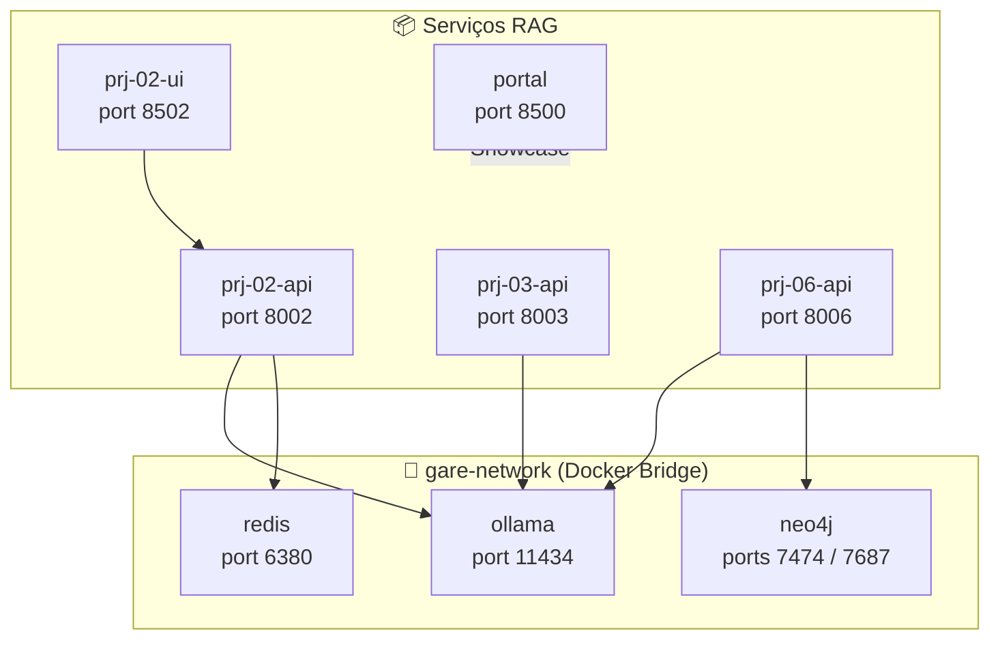

# PRJ-09_Deploy_Cloud — Spec (SDD)

> **Padrão Oficial:** BMAD + SDD + TDD  
> **Última Atualização:** 2026-05-24  
> **Status:** ✅ Concluído | **Jira:** GARE-88

---

## 1. 🏗️ BMAD (Baseline Architecture)

*Orquestração Docker unificada de todos os projetos RAG do portfólio.*

---

## 2. 📝 SDD (Spec-Driven Development)

### Objetivo Principal
Criar a **camada de deploy unificado** do ecossistema GIULIA AI. Um único `docker-compose.yml` orquestra toda a infraestrutura (Ollama, Redis, Neo4j) e os serviços dos projetos RAG, com rede interna isolada (`gare-network`). O Portal GIULIA AI é o ponto de entrada público que consolida acesso a todos os projetos.

### Serviços Orquestrados

| Serviço | Imagem / Build | Porta Externa | Dependências |
|---------|---------------|---------------|-------------|
| `ollama` | `ollama/ollama:latest` | 11434 | — |
| `redis` | `redis:alpine` | 6380 | — |
| `neo4j` | `neo4j:latest` | 7474, 7687 | — |
| `prj-02-api` | Build monorepo + Dockerfile | 8002 | ollama, redis |
| `prj-02-ui` | Build monorepo + Dockerfile | 8502 | prj-02-api |
| `prj-03-api` | Build monorepo + Dockerfile | 8003 | ollama |
| `prj-06-api` | Build monorepo + Dockerfile | 8006 | ollama, neo4j |
| `portal` | Build monorepo + Dockerfile | 8500 | — |

### Estratégia de Build

Todos os serviços de aplicação usam **um único Dockerfile** em `docker/Dockerfile`, com `context` apontando para a raiz do monorepo (`../..`). O `working_dir` de cada serviço define qual projeto é executado. O volume `../..:/app` monta o monorepo completo dentro do container — isso permite reuso de código compartilhado (`INFRA/`, `shared/`) sem duplicação de imagens.

### Configurações de Rede

- **`gare-network` (bridge):** Todos os serviços se comunicam internamente pelo nome do container (DNS Docker)
- **Redis:** Mapeado na porta `6380:6379` (padrão do projeto — evita conflito com Redis local)
- **`restart: unless-stopped`:** Serviços de infra (Ollama, Redis, Neo4j) reiniciam automaticamente

### Variáveis de Ambiente Injetadas (por serviço)

| Serviço | Variáveis |
|---------|-----------|
| `prj-02-api` | `OLLAMA_HOST=http://ollama:11434`, `REDIS_HOST=redis`, `REDIS_PORT=6379` |
| `prj-03-api` | `OLLAMA_HOST=http://ollama:11434` |
| `prj-06-api` | `OLLAMA_HOST=http://ollama:11434`, `NEO4J_URI=bolt://neo4j:7687`, `NEO4J_USER`, `NEO4J_PASSWORD` |

### Volumes Persistentes

| Volume | Serviço | Propósito |
|--------|---------|-----------|
| `ollama_data` | ollama | Modelos LLM baixados persistem entre restarts |
| `neo4j_data` | neo4j | Grafo de conhecimento persiste entre restarts |
| `redis_data` | redis | Declarado mas não montado (Redis ephemeral por design) |

### Guardrails

- **`depends_on` enforcement:** Serviços de API só sobem após infra estar disponível
- **Rede isolada:** Nenhum serviço expõe portas internas além do mapeamento explícito — zero exposição acidental
- **Dockerfile único:** Garante ambiente idêntico entre todos os projetos RAG (mesma versão de Python, deps base)

### Fluxo de Exceções

| Cenário | Comportamento |
|---------|---------------|
| Ollama não baixou modelo | Serviço inicia mas retorna erros nas queries; `ensure_ollama_running()` nos projetos gerencia o pull |
| Neo4j demora para iniciar | `prj-06-api` tenta reconectar; `self.graph = None` até conexão estabelecida |
| Redis offline | `prj-02-api` perde histórico conversacional; degrada para stateless |
| Portal sem API | Portal exibe links mas APIs respondem 503 individualmente |

---

## 3. 🧪 TDD

| Teste | Critério |
|-------|----------|
| `test_docker_compose_valid` | `docker compose config` retorna exit 0 sem erros |
| `test_gare_network_exists` | Rede `gare-network` criada após `docker compose up` |
| `test_ollama_reachable` | `GET http://localhost:11434/api/tags` retorna 200 |
| `test_redis_reachable` | `redis-cli -p 6380 ping` retorna `PONG` |
| `test_neo4j_reachable` | `GET http://localhost:7474` retorna 200 |
| `test_prj02_api_health` | `GET http://localhost:8002/health` retorna 200 |
| `test_prj03_api_health` | `GET http://localhost:8003/health` retorna 200 |
| `test_prj06_api_health` | `GET http://localhost:8006/health` retorna 200 |
| `test_portal_accessible` | `GET http://localhost:8500` retorna 200 |
| `test_volumes_persisted` | Dados do Neo4j sobrevivem a `docker compose restart neo4j` |

**Status:** ✅ Validado. Orquestração completa do portfólio RAG via Docker Compose operacional.
